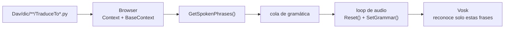
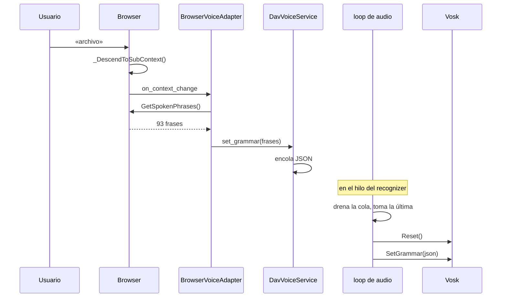

# Acortador de gramática de Vosk

Cómo DAV limita lo que el reconocedor puede oír a los comandos válidos del
contexto de navegación activo, en vez de dejarlo competir contra el vocabulario
entero del modelo.

Resuelto en el PR #178 (integra el #176 de SoPerez1). El análisis que lo motivó
está en [`pendientes-dav.md`](pendientes-dav.md) §10.

---

## El problema

`vosk-model-small-es-0.42` carga **100.001 palabras**. El árbol `Dav/dic/` usa
**745** (0,75 %), y la mediana por contexto es de **12 frases**.

Sin gramática, Vosk elige la palabra más probable entre las 100.001 en cada
frase. De ahí los síntomas registrados: «croquis» transcripto como «crockett»,
un «traffic» que nadie dijo.

No se arregla con un modelo más grande — eso mejora el modelo acústico, no la
competencia por frase. Se arregla acotando el vocabulario candidato.

---

## La idea

En cualquier momento de la navegación, el conjunto de cosas que el usuario
*puede* decir es chico y conocido: los comandos del nivel donde está parado, los
saltos a la raíz, y los verbos de navegación. Esa lista se le pasa a Vosk como
gramática, y el reconocedor deja de considerar todo lo demás.

Al cambiar de nivel, la gramática se recalcula.



---

## De dónde salen las frases

`Browser.GetSpokenPhrases()` ([`navigation/browser.py`](../scr/ComponentesDAV/IntegracionGUI/GUIFreeCad/navigation/browser.py))
junta cuatro fuentes, **todas del diccionario**:

| Fuente | De dónde sale | Ejemplo en la raíz |
| --- | --- | --- |
| `self.Context` | El `TraduceTo*.py` de la carpeta donde está parado | `archivo`, `banco de trabajo` |
| `self.BaseContext` | Claves internas del nivel raíz | `explorer` |
| `_base_translate` | `Dav/dic/TraduceTo*.py` — saltos a raíz desde cualquier nivel | `explorador`, `dibujar` |
| `_nav_translate` | `Dav/dic/NavCommands/TraduceTo*.py` | `subir`, `volver`, `contexto`, `enviar`, `cancelar` |

De cada entrada toma **dos** cosas: la frase hablada (`Spoken`) y la clave
interna (`InternalKey`). Por eso en la gramática conviven `explorador` (español)
y `explorer` (clave interna).

Lo único que **no** sale del diccionario es `[unk]`, el comodín con que Vosk
absorbe ruido y palabras fuera de contexto sin forzar un comando incorrecto.

> **Agregar un sinónimo es editar un `TraduceTo*.py`.** No hay que tocar
> `browser.py` ni nada del motor de voz: la palabra aparece en la gramática al
> reiniciar. Esto vale también para `enviar` y `cancelar`, que hasta el PR #178
> estaban escritos en tres lugares del código.

### Tamaños reales

Medidos en una sesión dentro de FreeCAD, en español:

| Contexto | Frases |
| --- | --- |
| Raíz | 54 |
| Archivo | 93 |
| Archivo → Nuevo | 120 |
| Sketcher | 199 |
| Preferencias (`all_grammar_phrases()`) | 82 |

Contra las 100.001 del modelo abierto.

---

## Cómo se aplica

La gramática se aplica **dentro del hilo dueño del recognizer**, nunca desde el
hilo de la GUI. Quien navega solo encola; el loop de audio consume.



### Por qué `Reset()` antes de `SetGrammar()`

**Vosk aborta el proceso** si se le cambia la gramática a un recognizer que ya
procesó audio:

```
SetGrm():recognizer.cc:235
"Can't add speaker model to already running recognizer"
```

No es una excepción de Python: ningún `try/except` la atrapa, y se lleva FreeCAD
entero. En el `crash.log` de FreeCAD aparece como `Recognizer::SetGrm`.

Verificado contra el modelo `pt` en procesos separados:

| escenario | resultado |
| --- | --- |
| `SetGrammar` antes de cualquier audio | ok |
| `SetGrammar` después de audio | **ERROR → crash** |
| `Reset()` + `SetGrammar` | ok |

`Reset()` devuelve el recognizer a estado inicial y ahí sí acepta la gramática
nueva.

### Por qué solo la última de la cola

Si se encolaron varias gramáticas mientras el loop estaba en `AcceptWaveform`,
las intermedias ya no describen el contexto actual. Aplicarlas todas hacía que
las gramáticas de preferencias (82 frases) y de CAD (54) se pisaran alternándose,
y como cada aplicación hace `Reset()` —que descarta el audio a medio reconocer—
**ninguna frase llegaba a completarse**. El micrófono parecía muerto.

El loop drena la cola, se queda con la última, y no la reaplica si es igual a la
vigente.

---

## Los dos modos

`DavVoiceService` sirve a dos consumidores con gramáticas distintas:

| Modo | Gramática | Origen |
| --- | --- | --- |
| `cad` | Contexto de navegación activo | `Browser.GetSpokenPhrases()` |
| `preferences` | 81 frases de configuración + `[unk]` | `speech/voice_commands.all_grammar_phrases()` |

Al cerrar Preferencias, `detach_preferences()` → `resume_cad_voice()` restaura la
gramática de CAD.

---

## Límites conocidos

**La gramática restringe el vocabulario, no la sintaxis.** Vosk puede combinar
varias palabras válidas en una frase sin sentido. En el log aparecieron cosas
como `«extender oblongo»` o `«editar de trabajo crear vistas estándar»`: ninguna
ejecutó nada, pero muestra que con 199 frases activas (Sketcher) hay más
superficie para que el ruido encaje en algo.

**Palabras que no están en el modelo no se pueden reconocer.** Si un
`TraduceTo*.py` agrega una palabra que el modelo Vosk no conoce, entra en la
gramática pero nunca va a matchear. `SetGrammar` no avisa: falla en silencio.

**La gramática y el modelo tienen que ser del mismo idioma.** Aplicar una
gramática en español sobre el modelo portugués no lanza excepción, simplemente
deja de reconocer todo.

---

## Diagnóstico

Todo esto queda registrado en `config/dav.log` (ver
[`core/dav_log.py`](../scr/ComponentesDAV/IntegracionGUI/GUIFreeCad/core/dav_log.py)):

```
14:44:03  cad: frase reconocida 'archivo'
14:44:03  aplicando gramatica: 120 frases
14:44:03  gramatica aplicada
```

El «aplicando» se escribe **antes** de llamar a `SetGrammar`: si el log corta ahí
sin el «gramatica aplicada» que le sigue, esa gramática es la que tumbó el
proceso.

Señales de que algo anda mal:

- Gramáticas alternándose sin que el usuario navegue (`82 / 54 / 82 / 54`) → dos
  modos peleándose el recognizer.
- `aplicando` sin su `gramatica aplicada` → crash en `SetGrammar`.
- Ninguna línea de gramática en toda la sesión → el acortador no está entrando y
  Vosk reconoce contra el modelo completo.

---

## Archivos

| Archivo | Rol |
| --- | --- |
| `navigation/browser.py` | `GetSpokenPhrases()`, `GetNavWords()` |
| `speech/dav_voice_service.py` | Cola de gramática, `Reset()` + `SetGrammar()` en el loop |
| `integration/browser_voice_adapter.py` | Encola al cambiar de contexto |
| `speech/voice_commands.py` | `all_grammar_phrases()` del modo preferencias |
| `Dav/dic/NavCommands/` | `subir`, `contexto`, `enviar`, `cancelar` |
| `Dav/dic/**/TraduceTo*.py` | Todo el resto del vocabulario |
