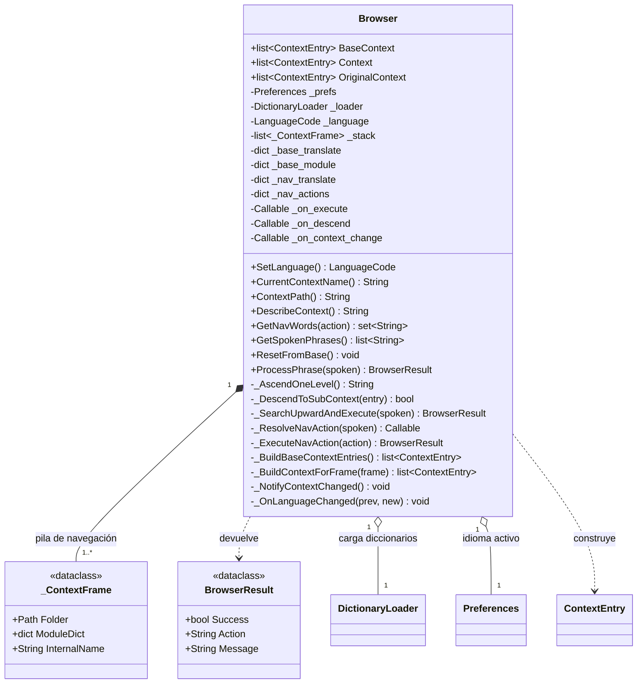

# Browser

> **Archivo:** `Dav/scr/ComponentesDAV/IntegracionGUI/GUIFreeCad/navigation/browser.py`

Motor de navegación del árbol de comandos por voz. Recorre `Dav/dic/`
manteniendo una pila de contextos: cada frase reconocida se resuelve contra el
nivel actual, y si es un submenú se desciende.

Es el `DAVAgent` del diseño conceptual original, con otro nombre y otra
implementación: `ProcessPhrase` + `DictionaryLoader` en vez de
`latentListening` + `searchInstruction`.

## Responsabilidades

| Método | Qué hace |
| --- | --- |
| `ProcessPhrase(spoken)` | Punto de entrada. Resuelve una frase contra el contexto activo: comando de navegación, salto a raíz, descenso a submenú, ejecución, o búsqueda ascendente |
| `GetSpokenPhrases()` | Gramática de Vosk del nivel activo. Ver [`acortador-gramatica-vosk.md`](../acortador-gramatica-vosk.md) |
| `GetNavWords(action)` | Palabras ligadas a un sentinel de `NavCommands` (`up`, `send`, `cancel`, `show_context`) en el idioma activo |
| `DescribeContext()` | Texto legible de dónde está parado el usuario y qué puede decir |
| `ResetFromBase()` | Recarga todo desde `base.py`. Se dispara al cambiar de idioma |

## Notas de diseño

- **No conoce FreeCAD.** Ejecuta callables que vienen de los diccionarios; quién
  los provee es problema del `DictionaryLoader`.
- **Un idioma por vez.** `_OnLanguageChanged` está registrado en `Preferences`,
  así que cambiar el idioma reconstruye los contextos.
- `_on_context_change` notifica a quien tenga que recalcular la gramática de voz.
  Hoy lo usa `BrowserVoiceAdapter`.
