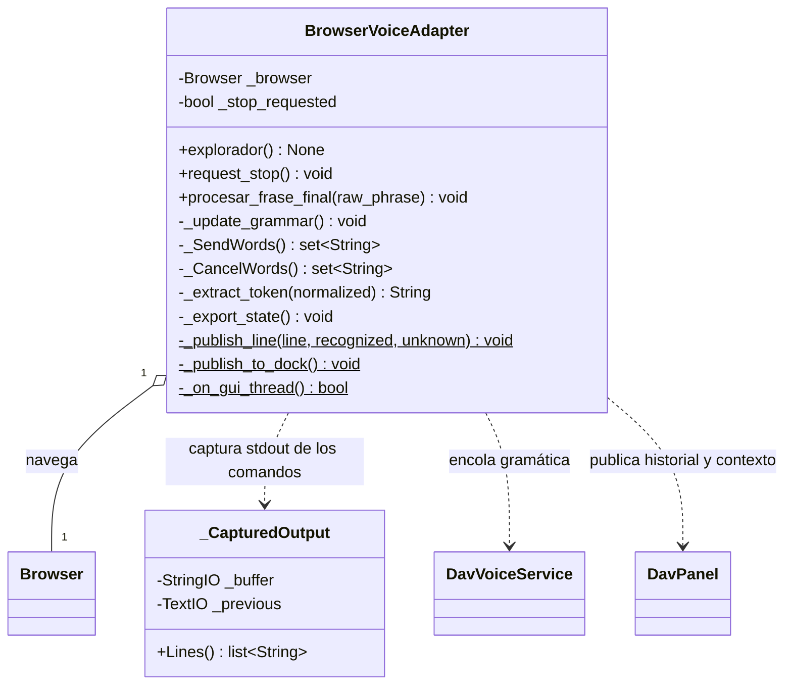
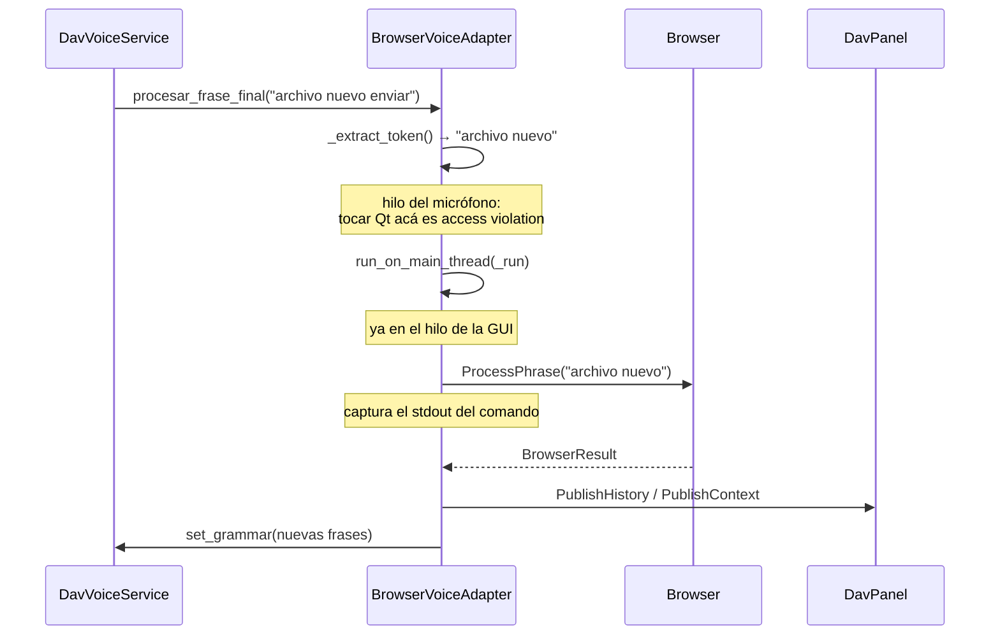

# BrowserVoiceAdapter

> **Archivo:** `Dav/scr/ComponentesDAV/IntegracionGUI/GUIFreeCad/integration/browser_voice_adapter.py`

Une el motor de voz con el `Browser`. Recibe la frase cruda que reconoció Vosk,
la limpia, la manda a navegar, y publica el resultado en el panel DAV.

## El flujo de una frase

## Por qué existe `_CapturedOutput`

Los comandos de los diccionarios (los `ayuda.py` sobre todo) escriben su salida
con `print`: son **988 llamadas repartidas en 123 archivos**. En FreeCAD eso va
al Report View, no al panel DAV.

En vez de tocar cada comando, se captura `sys.stdout` mientras corre el comando y
se vuelca al panel. Restaura `sys.stdout` incluso si el comando lanza.

## Notas de diseño

- **`procesar_frase_final` corre en el hilo del micrófono.** Tocar un widget Qt
  desde ahí es access violation: crashea el proceso sin pasar por ningún
  `except`. Por eso todo lo que llega a la GUI va dentro de
  `run_on_main_thread`, y `_on_gui_thread()` verifica antes de publicar.
- **`_SendWords()` / `_CancelWords()` salen del diccionario**
  (`Browser.GetNavWords`), no de constantes. Las constantes `_SEND_WORDS` y
  `_CANCEL_WORDS` quedan solo como respaldo por si `NavCommands` no carga.
- `_extract_token` corta el `enviar` final de «archivo nuevo enviar» y devuelve
  `False` si la frase termina en una palabra de cancelación.
