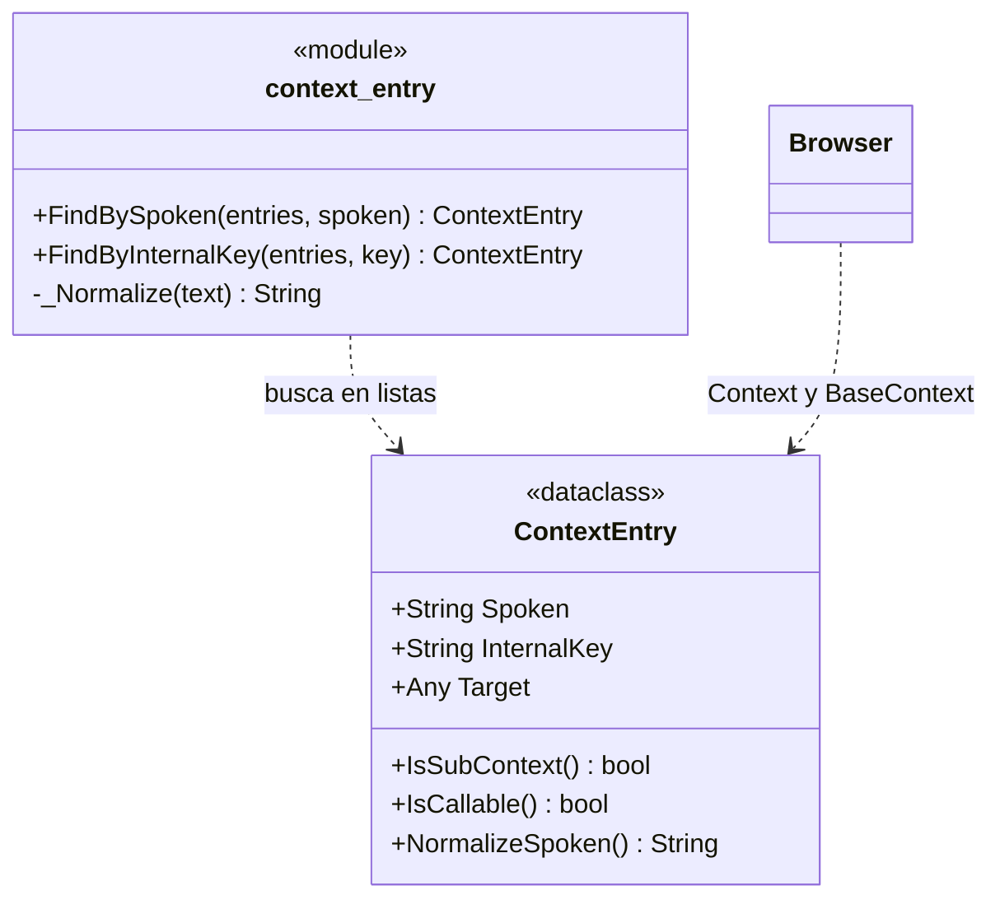

# ContextEntry

> **Archivo:** `Dav/scr/ComponentesDAV/IntegracionGUI/GUIFreeCad/navigation/context_entry.py`

Una entrada del contexto de navegación: liga una frase hablada a una clave
interna y a lo que hay que ejecutar. Es la unidad con la que trabaja el
`Browser`.

## Los dos tipos de entrada

El `Target` decide qué es la entrada:

| `Target` | `IsSubContext()` | `IsCallable()` | Qué pasa al decirlo |
| --- | --- | --- | --- |
| `dict` | `True` | `False` | Se desciende un nivel |
| callable | `False` | `True` | Se ejecuta el comando de FreeCAD |

Esa distinción es la que hace navegable el árbol, y es también la razón de la
regla de los subcontextos anidados: si un submenú se fusiona con `.update()` en
vez de ir bajo su propia clave, sus hojas quedan sueltas en el nivel padre y la
carpeta desaparece del árbol. Ver `pendientes-dav.md` §4.

## Notas de diseño

- **`Spoken` e `InternalKey` son distintos a propósito.** `Spoken` es lo que dice
  el usuario («explorador»); `InternalKey` es la clave del diccionario base
  (`explorer`). Ambos entran en la gramática de Vosk.
- **La búsqueda es por frase normalizada**, no por igualdad exacta: `_Normalize`
  saca acentos, pasa a minúsculas y colapsa espacios, así «dónde estoy» y «donde
  estoy» resuelven igual.
