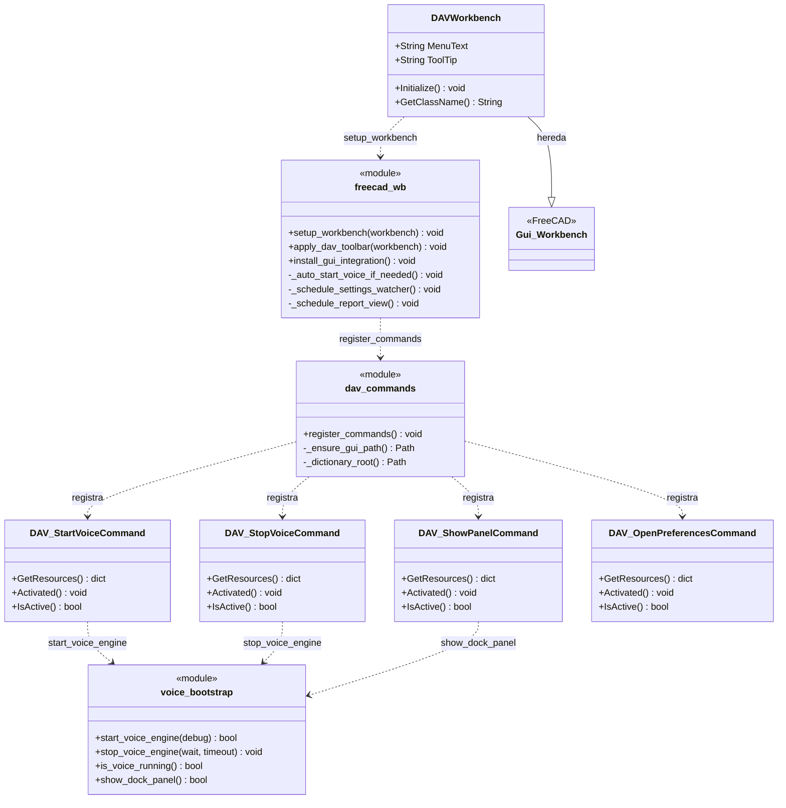
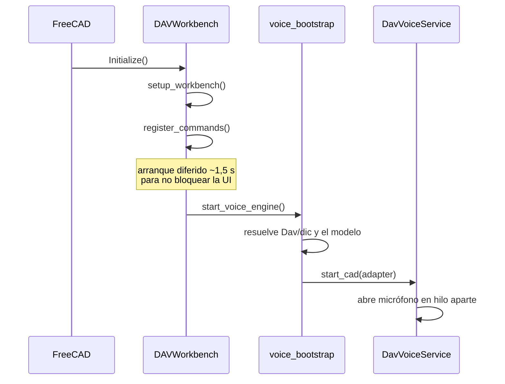

# DAVWorkbench y comandos

> **Archivos:**
> `Dav/scr/ComponentesDAV/Dav/InitGui.py`
> `Dav/scr/ComponentesDAV/Dav/scr/gui/dav_commands.py`
> `Dav/scr/ComponentesDAV/Dav/scr/gui/freecad_wb.py`

El workbench que FreeCAD carga al arrancar. Registra los comandos de la barra
DAV y levanta el motor de voz.

## El arranque

## Notas de diseño

- **Hay varios puntos que llaman `start_voice_engine`** (el comando de la barra,
  el workbench al activarse, `freecad_voice_setup`): el log muestra unas cuatro
  llamadas por arranque. No se pisan —están separadas en el tiempo y las frena
  `is_cad_engine_loaded()`— así que solo la primera abre micrófono. Por eso el
  arranque se loguea a nivel `debug`.
- Los mensajes `[DAV]` van a la pestaña **Informe** de FreeCAD, no a la consola
  Python. El log de verdad está en `config/dav.log`.
