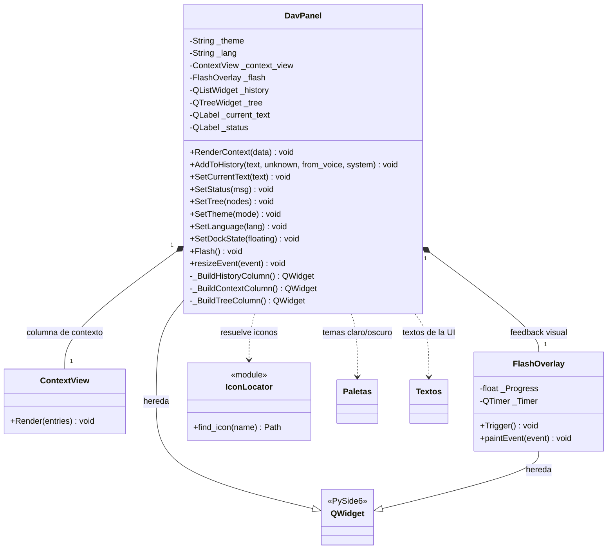
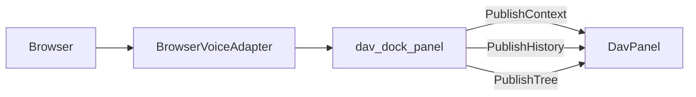

# DavPanel

> **Archivo:** `Dav/scr/ComponentesDAV/InterfazDAV/DavPanel.py`

La GUI de DAV: un widget que vive dentro de FreeCAD como `QDockWidget`. Muestra
el contexto de navegación, el historial de comandos y el árbol de objetos del
documento.

Reemplazó a `MainWindow.py` (1011 líneas, proceso externo) en la migración
documentada en [`plan-unificacion-guis.md`](../plan-unificacion-guis.md).

## Cómo se alimenta

El panel **no importa FreeCAD ni el `Browser`**: recibe datos y emite señales.
Quien lo conecta es `integration/dav_dock_panel.py`.

Esa separación es a propósito: permite testear el widget sin levantar FreeCAD.

## Notas de diseño

- **Todo lo que entra al panel tiene que venir del hilo de la GUI.** Tocar un
  widget Qt desde el hilo del micrófono es access violation. `BrowserVoiceAdapter`
  verifica con `_on_gui_thread()` antes de publicar.
- El ocultar/mostrar lo da el `QDockWidget` que lo contiene, no el panel: eso
  cubre el requisito de «minimizarse» del MVP.
- El árbol de objetos se arma desde `App.ActiveDocument` con un
  `DocumentObserver`, sin macro ni polling.
