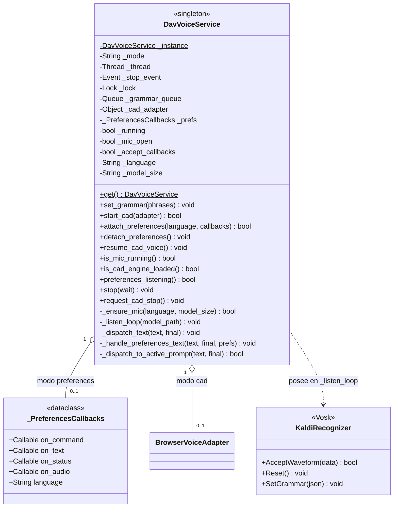
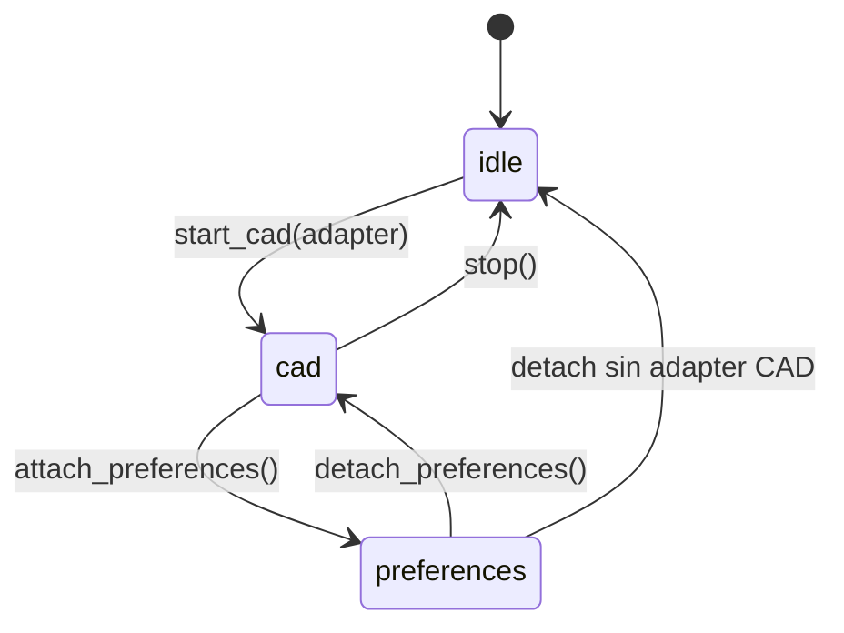

# DavVoiceService

> **Archivo:** `Dav/scr/ComponentesDAV/IntegracionGUI/GUIFreeCad/speech/dav_voice_service.py`

Singleton que posee el micrófono y el recognizer de Vosk. Un solo hilo de audio
para todo DAV: lo comparten la navegación CAD y el diálogo de Preferencias, que
antes competían por el dispositivo.

## Los dos modos

| Modo | Quién consume | Gramática |
| --- | --- | --- |
| `cad` | `BrowserVoiceAdapter` | Contexto de navegación activo |
| `preferences` | Diálogo de Preferencias | 81 frases de configuración |
| `idle` | Nadie | Micrófono cerrado |

## El hilo de audio

`_listen_loop` corre en un hilo aparte (`DAV-VoiceService`) para no bloquear la
UI de FreeCAD. En cada vuelta:

1. Drena `_grammar_queue` y se queda con la última gramática
2. Si cambió: `Reset()` + `SetGrammar()` — **siempre en este hilo**, nunca desde
   la GUI
3. `AcceptWaveform()` y despacha el texto según el modo

Detalle de por qué el `Reset()` es obligatorio (Vosk aborta el proceso sin él):
[`acortador-gramatica-vosk.md`](../acortador-gramatica-vosk.md).

## Notas de diseño

- **`_ensure_mic` reinicia el hilo si cambió el idioma o el tamaño del modelo**,
  porque el modelo se carga una sola vez al crear el recognizer.
- Los fallos del hilo quedan en `config/dav.log`: si el log corta sin la línea
  `hilo de voz terminado`, el proceso murió dentro del loop.
- `_dispatch_to_active_prompt` da prioridad a los `InputPrompts` abiertos sobre
  la navegación normal.
