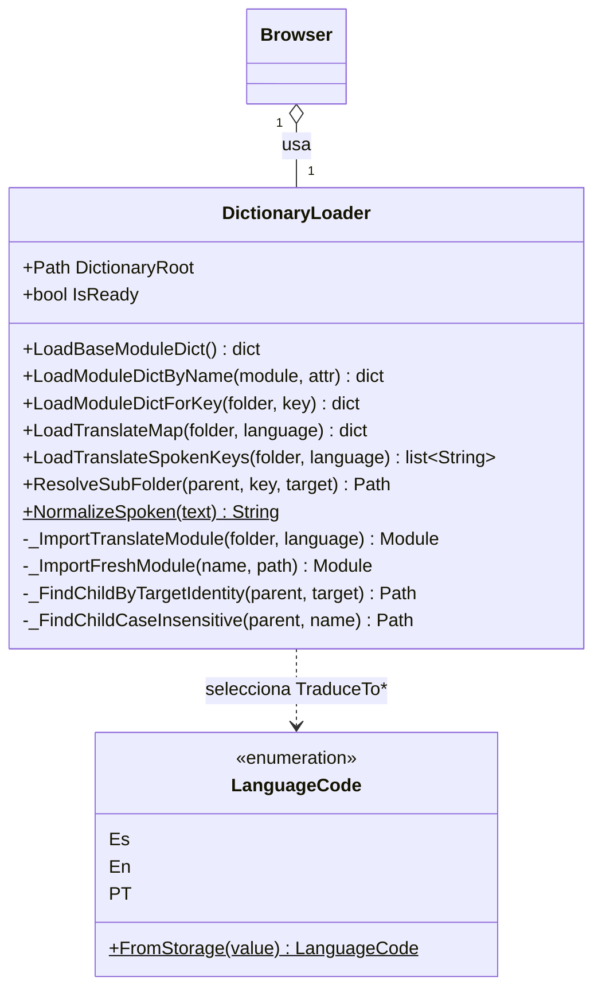

# DictionaryLoader

> **Archivo:** `Dav/scr/ComponentesDAV/IntegracionGUI/GUIFreeCad/navigation/dictionary_loader.py`

Carga los módulos de `Dav/dic/` desde disco: el diccionario base, las
traducciones por idioma y los submenús. Aísla al `Browser` del sistema de
archivos y de los detalles de importación.



## Qué archivos busca

```
Dav/dic/
├── base.py                 → LoadBaseModuleDict()
├── TraduceToEs.py          → LoadTranslateMap(root, Es)
├── NavCommands/
│   ├── NavActions.py       → LoadModuleDictByName("NavCommands.NavActions", "NavActions")
│   └── TraduceToEs.py      → LoadTranslateMap(NavCommands, Es)
└── explorer/
    ├── explorer.py         → diccionario base de la carpeta
    └── TraduceToEs.py      → LoadTranslateMap(explorer, Es)
```

Una carpeta = un nivel de contexto. Cada una tiene su diccionario base (claves
internas → callables de FreeCAD) y sus traducciones por idioma (frases habladas →
los mismos callables).

## Notas de diseño

- **Tolera que el diccionario no exista.** Si falta la carpeta o un módulo falla
  al importar, devuelve vacío y deja un mensaje: el motor arranca con contextos
  vacíos en vez de romper el arranque de FreeCAD.
- **`ResolveSubFolder` empareja por identidad del `Target`**, no por nombre de
  carpeta: el nombre puede diferir de la clave interna.
- `_ImportFreshModule` fuerza la recarga para que un cambio en un diccionario se
  vea sin reiniciar FreeCAD.
- La normalización de acentos vive acá (`NormalizeSpoken`) y debe ser la misma
  que usa `ContextEntry`. Ver `pendientes-dav.md` §7.
