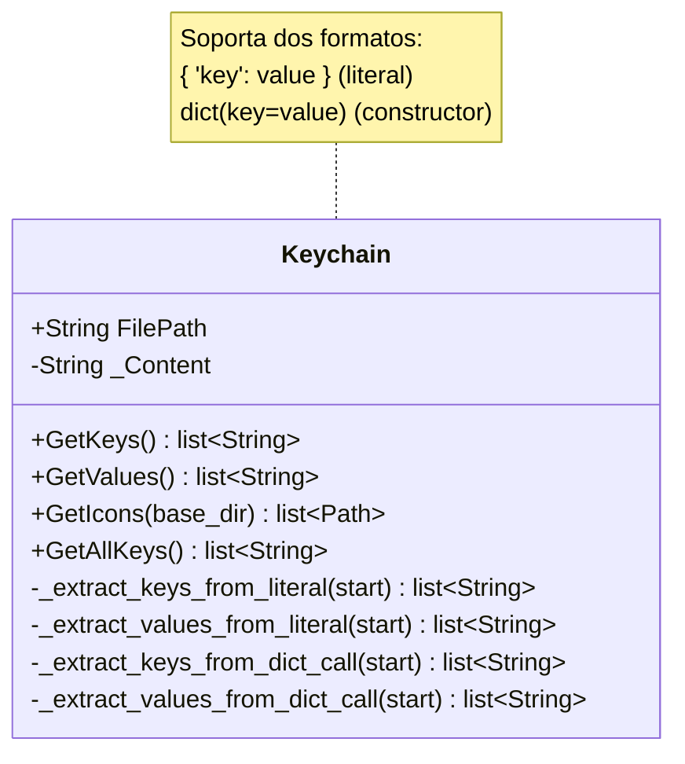

# Keychain

> **Archivo:** `Dav/scr/ComponentesDAV/Keychain/Keychain.py`

Extrae las claves y los iconos de un diccionario `.py` **sin ejecutarlo**:
parsea el texto del archivo. Sirve para leer los diccionarios desde fuera de
FreeCAD, donde `import FreeCADGui` fallaría.

## Por qué no se importa el módulo

Los diccionarios de `Dav/dic/` hacen `import FreeCADGui` en su cabecera. Fuera de
FreeCAD eso lanza `ModuleNotFoundError`, así que cualquier herramienta externa
que quiera listar los comandos —un test, un script de auditoría, la GUI cuando
corría como proceso aparte— no puede simplemente importarlos.

`Keychain` lee el archivo como texto y saca las claves con parseo. No ejecuta
nada, así que no necesita FreeCAD.

## Notas de diseño

- **Es tolerante pero no infalible.** Al ser parseo de texto y no AST, formatos
  raros pueden escapársele. Si un diccionario no aparece donde debería, revisar
  primero que use uno de los dos formatos soportados.
- El `Browser` **no** usa `Keychain`: dentro de FreeCAD importa los módulos de
  verdad vía `DictionaryLoader`, que sí puede resolver los callables.
