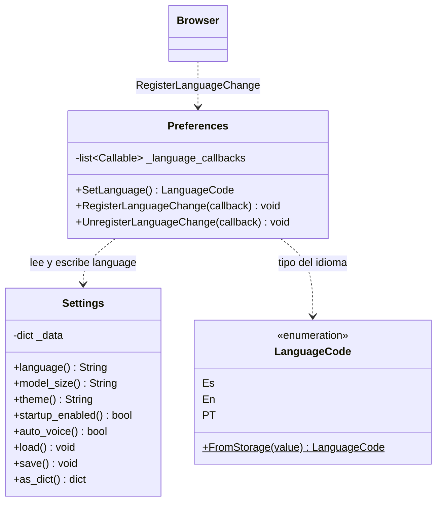

# Preferences y Settings

> **Archivos:**
> `Dav/scr/ComponentesDAV/IntegracionGUI/GUIFreeCad/core/preferences.py`
> `Dav/scr/ComponentesDAV/IntegracionGUI/GUIFreeCad/core/settings.py`

Dos clases con roles distintos que conviene no confundir: `Settings` persiste la
configuración en disco; `Preferences` expone el idioma activo al `Browser` y
avisa cuando cambia.



## El flujo de un cambio de idioma

```mermaid
sequenceDiagram
    participant D as Diálogo Preferencias
    participant P as Preferences
    participant S as Settings
    participant B as Browser
    participant V as DavVoiceService

    D->>P: SetLanguage = LanguageCode.Es
    P->>S: language = "es" ; save()
    P->>B: callback(previo, nuevo)
    B->>B: ResetFromBase()
    Note over B: recarga TraduceToEs.py<br/>de todo el árbol
    D->>V: reinicia el micrófono
    Note over V: hay que recargar el modelo:<br/>es otro archivo Vosk
```

## Notas de diseño

- **`Preferences` es el único que debería escribir el idioma.** Es el punto donde
  se dispara la recarga de diccionarios; escribir `settings.language` a mano se
  la saltea.
- **El observer es una lista, no un callback único** (`RegisterLanguageChange`),
  así varios interesados pueden suscribirse sin pisarse.
- `Settings` guarda en `config/settings.json`, que está en `.gitignore`: es
  configuración de usuario, no del repositorio.
- Cambiar el idioma **obliga a reiniciar el hilo de voz**, porque el modelo Vosk
  se carga una sola vez al crear el recognizer y cada idioma es un modelo
  distinto.
