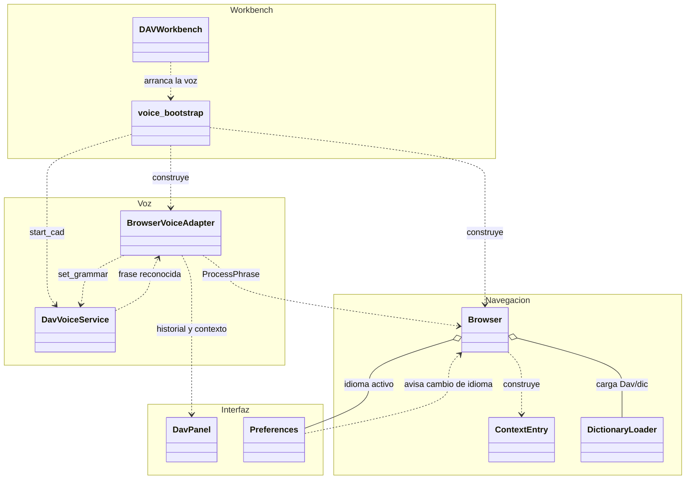
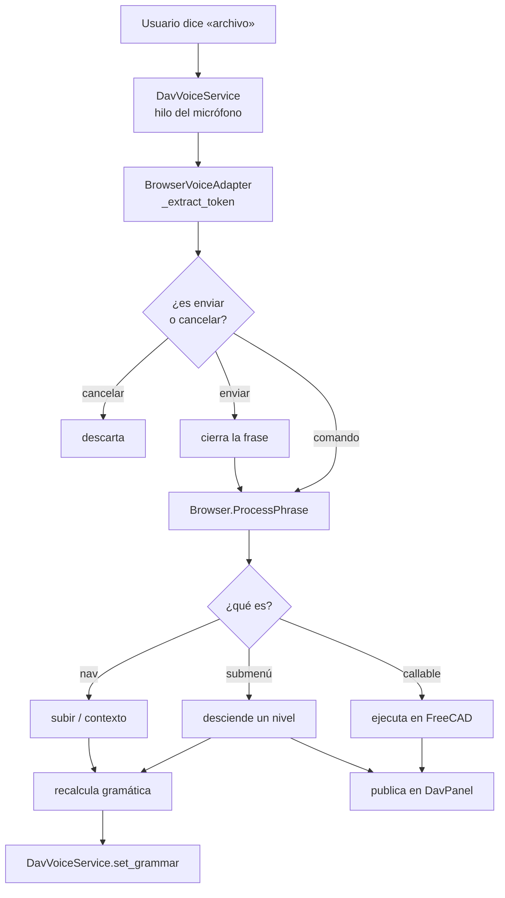

# Diagramas de clases — DAV

Un archivo por clase, con el nombre de la clase. Cada uno tiene el diagrama en
Mermaid, la tabla de responsabilidades y las notas de diseño que no se ven en la
firma de los métodos.

> Antes esto era un único `diagramas_clases_DAV.md`. Se separó y se actualizó:
> documentaba `MainWindow` y `VoiceWorker`, que ya no existen (ver
> [`completados-dav.md`](../completados-dav.md)).

## Motor de navegación

| Clase | Rol |
| --- | --- |
| [`Browser`](Browser.md) | Recorre el árbol de `Dav/dic/` y resuelve cada frase |
| [`ContextEntry`](ContextEntry.md) | Una entrada del contexto: frase → clave → target |
| [`DictionaryLoader`](DictionaryLoader.md) | Carga los módulos del diccionario desde disco |

## Voz

| Clase | Rol |
| --- | --- |
| [`DavVoiceService`](DavVoiceService.md) | Singleton del micrófono y el recognizer Vosk |
| [`BrowserVoiceAdapter`](BrowserVoiceAdapter.md) | Une la voz con el `Browser` y publica al panel |

Cómo se acota la gramática al contexto:
[`acortador-gramatica-vosk.md`](../acortador-gramatica-vosk.md).

## Interfaz y configuración

| Clase | Rol |
| --- | --- |
| [`DavPanel`](DavPanel.md) | El widget acoplado dentro de FreeCAD |
| [`Preferences`](Preferences.md) | Idioma activo y persistencia de la configuración |
| [`DAVWorkbench`](DAVWorkbench.md) | Workbench de FreeCAD y comandos de la barra |
| [`Keychain`](Keychain.md) | Lee diccionarios `.py` sin ejecutarlos |

---

## Vista general

Cómo se conectan las piezas cuando el usuario dice algo.

## El recorrido de una frase

