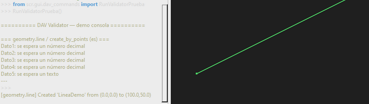
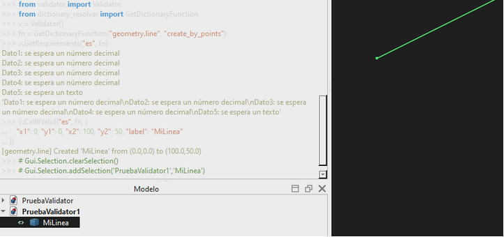
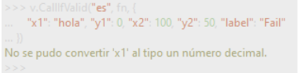
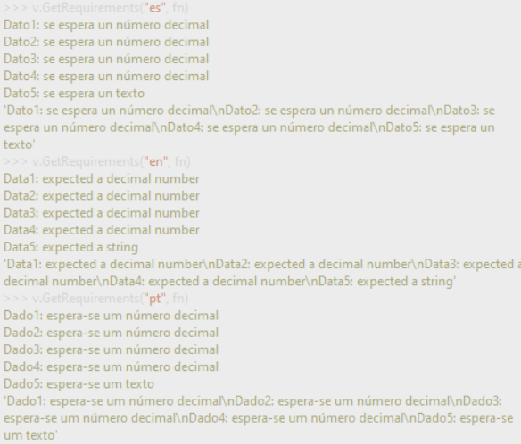
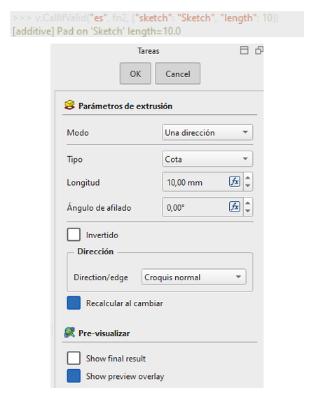
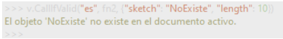
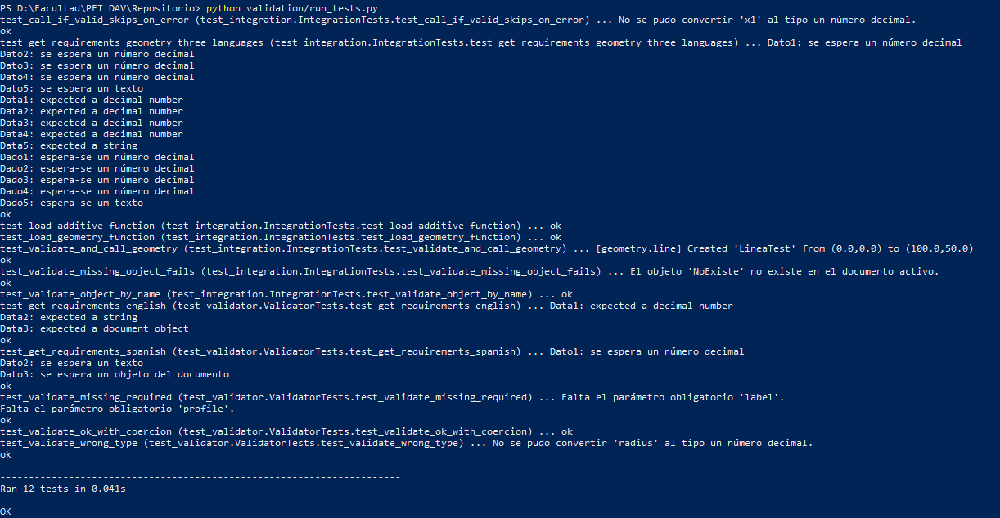

# Ticket de testeo — Validator

Completar y adjuntar capturas en el Word o en esta carpeta.

| Campo | Valor |
|-------|-------|
| Módulo | `validation/Validator` |
| Rama | `Pruebas` |
| Fecha | `16/06` |
| Integrantes | `Luigi Mete, Sofia Perez, Alex Alvez, Franco Camen` |

---

## CP-01 — Documento activo + demo automática

- [x] Ejecuté `App.newDocument("PruebaValidator")`
- [x] Ejecuté `RunValidatorPrueba()`
- [x] geometry creó `LineaDemo` (es/en/pt)
- [x] additive sin sketch mostró error esperado
- [x] caso `NoExiste` mostró error esperado

**Captura:**  
**Estado:** [x] OK  [ ] FAIL  
**Observaciones:** __________

---

## CP-02 — Geometry OK (`MiLinea`)

- [x] `CallIfValid` con coords válidas creó `MiLinea`
- [x] Objeto visible en árbol del documento

**Captura:**   
**Estado:** [x] OK  [ ] FAIL  

---

## CP-03 — Geometry ERROR (tipo incorrecto)

- [x] `x1 = "hola"` produjo error de conversión
- [x] No se creó objeto `Fail`

**Captura:**    
**Estado:** [x] OK  [ ] FAIL  

---

## CP-04 — GetRequirements tres idiomas (geometry)

- [x] Español: Dato1…
- [x] Inglés: Data1…
- [x] Portugués: Dado1…

**Captura:**   
**Estado:** [x] OK  [ ] FAIL  

---

## CP-05 — Additive OK (con Sketch)

- [x] Sketch creado en Sketcher
- [x] `CallIfValid` con `"sketch": "Sketch"` ejecutó Pad
- [x] Consola: `[additive] Pad on 'Sketch'...`

**Captura:**   
**Estado:** [x] OK  [ ] FAIL  

---

## CP-06 — Additive ERROR (objeto inexistente)

- [x] `"sketch": "NoExiste"` → error, no ejecuta

**Captura:**    
**Estado:** [x] OK  [ ] FAIL  

---

## CP-07 — Tests automáticos (opcional)

- [x] `python validation/run_tests.py` → 12 tests OK

**Captura terminal:**    
**Estado:** [x] OK  [ ] FAIL  [ ] N/A  

---

## Conclusión general

_____________________________________________________________
`Durante las pruebas se verificó que el módulo Validator funciona correctamente para informar requisitos, validar datos de entrada y ejecutar funciones del diccionario solo cuando los parámetros cumplen con los tipos esperados. En el caso geometry.line, se generó correctamente una línea a partir de coordenadas válidas y se bloqueó la ejecución cuando se ingresó un valor inválido, como texto en un parámetro numérico. También se comprobó que GetRequirements muestra los requisitos en español, inglés y portugués. 
`
_____________________________________________________________

**Firma / fecha entrega:** __________
